# Správa hlasování v Heliosu

Předpokládáme, že již víte, jak v Heliosu hlasovat a jak se do něj přihlásit, a že máte nastudován příslušný [návod](helios.md). 

Tvorbu hlasování zahájíte z titulní stránky tlačítkem **Vytvořit hlasování** (musíte být přihlášen).

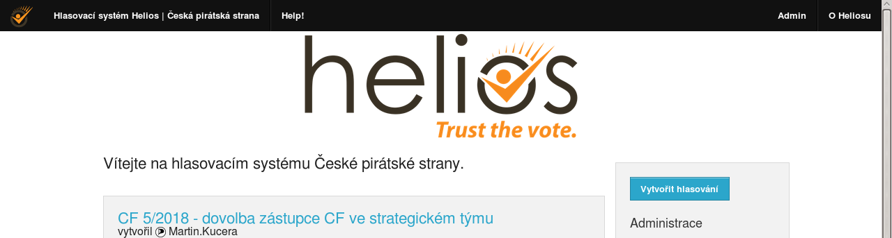

Objeví se formulář, v němž zadáte parametry hlasování. (Ty budete moci později podle potřeby upravit, ale jen do zahájení hlasování.)

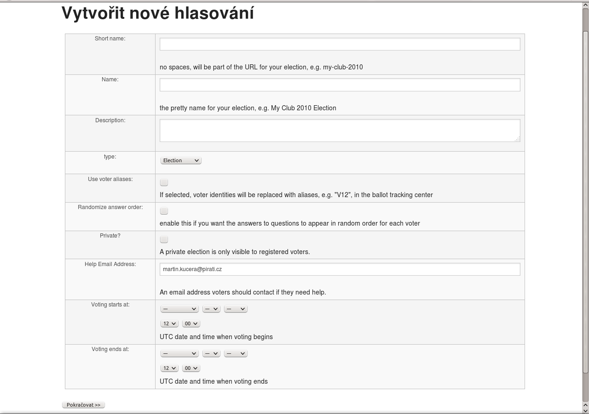

Do pole **Short name** zadejte krátký název (jen písmena bez diakritiky, číslice, pomlčky a podtržítka) hlasování, který pak bude zvořit součást URL odkazu na něj. Například *kf-msk-20-2018-zmena-rozpoctu*.    
Do pole **Name** zadejte název hlasování, který se bude zobrazovat jako jeho nadpis. Například *KF MSK 20/2018 Změna rozpočtu*.    
Do pole **Description** zadejte všechny důležité informace o hlasování, tedy zejména 
  * odkaz na rozpravu a závěrečné řeči
  * přehled možností, mezi kterými budou hlasující vybírat
  * způsob hlasování
  * začátek a konec hlasování   
  
Pro formátování textu použijte HTML syntaxi.   
Ve volbě **type** ponechte *Election*.   
Volbu **Use voter aliases** ponechte nezaškrtnutou. Úmožní to mj. snazší odhalení případného pokusu o podvodné hlasování.   
Volbu **Randomize answer order** ponechte nezaškrtnutou.    
Volbu **Private?** ponechte nezaškrtnutou.   
Do pole **Help Email Address** uveďte svou pirátskou mailovou adresu, aby vás hlasující mohli v případě problémů kontaktovat.   
Volbu **Voting starts at** nastavte na plánovaný čas zahájení hlasování. Časy se uvádějí v UTC, takže o 1 (resp. 2, pokud je letní čas) méně než náš místní čas. Pro zahájení v 10.00 letního času tedy nastavte 8.00.   
Volbu **Voting ends at** nastavte na plánovaný čas ukončení hlasování, opět v UTC.   
Pokud časy nenastavíte, bude hlasování zahájeno ihned po skončení tvorby hlasovacího lístku (viz dále) a ukončit jej budete muset ručně.

Po nastavení parametrů hlasování pokračujte tlačítkem **Pokračovat  >>** a dostanete se na úvodní stránku hlasování. Jeho parametry můžete upravovat po stisku tlačítka **upravit**.

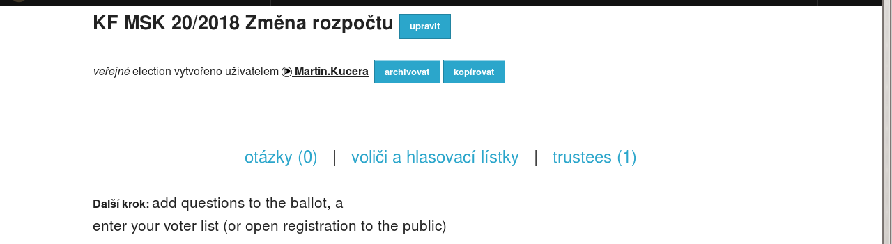

Nyní je třeba zadat otázku a seznam voličů. K zadání otázky se dostanete z odkazu **otázky (0)**.

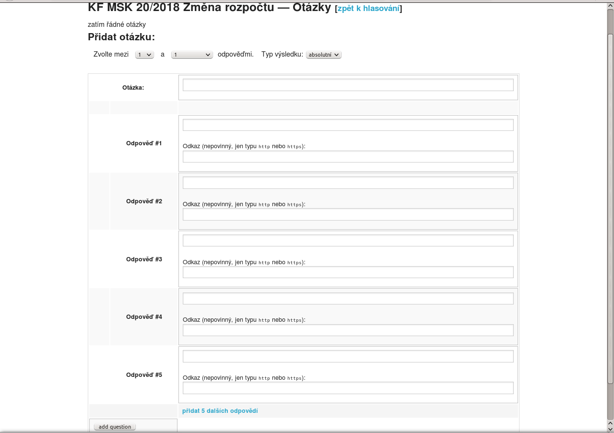

Ve volbě **Zvolte mezi 1 a 1 odpověďmi** nastavte jako horní hranici maximální počet hlasů, které má volič k dispozici. Typ výsledku ponechte *absolutní*.   
Do pole **Otázka** zadejte znění otázky, tedy například *Ve věci navrženého usnesení hlasuji pro*.   
Do polí **Odpověď #1** až **Odpověď #5** (nemusíte samozřejmě využít všechny) zadejte znění jednotlivých odpovědí, tedy například:   
**Odpověď #1:** *schválení usesení*   
**Odpověď #2:** *ukončení projednávání bez přijetí usnesení*   
V případě, že potřebujete více než 5 možností, klikněte na **přidat dalších 5 odpovědí**.   
Do polí **Odkaz** můžete vložit URL na stránku s podrobnějšími informacemi k dané možnosti, například při personálním hlasování odkaz na profil kandidáta.   
Zadávání otázky dokončíte tlačítkem **add question**.

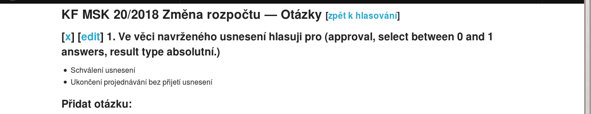

Otázku a odpovědi můžete později upravit klikem na **edit**, případně smazat klikem na **x**. Na úvodní stránku hlasování se vrátíte klikem na **zpět k hlasování**.

Seznam voličů přidáte z odkazu **voliči a hlasovací lístky**.

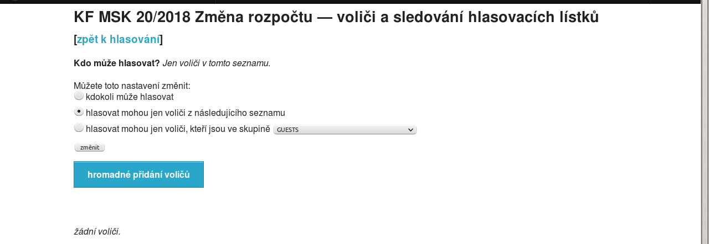

Zvolte možnost *hlasovat mohou jen voliči, kteří jsou ve skupině* a vyberte příslušnou skupinu oprávněných voličů, tedy například *KS Moravskoslezsky kraj*. Potvrďte tlačítkem **změnit**. Správnost nastavení se vám potvrdí vypsáním názvu skupiny pod text **Kdo může hlasovat?**, tedy např. *PirateID users in "KS Moravskoslezsky kraj" group*.   
Poté se vraťte na úvodní stránku hlasování přes odkaz **zpět k hlasování**.

Pro větší zabezpečení tajnosti hlasování je ještě žádoucí přidat tzv. *trustees*. Každý provádí jen částečné dešifrování výsledku hlasování, takže nikdo z nich nemůže dešifrovat výsledek sám. Trustees přidáte z odkazu **trustees (1)**.

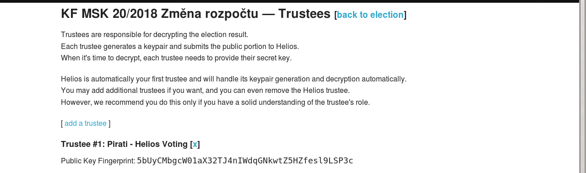

V systému je nastaven jeden "automatický" trustee, zabudovaný přímo v Heliosu. Dalšího přidáte kliknutím na **add a trustee** a potvrzením *OK* ve vyskočivším popup okénku.

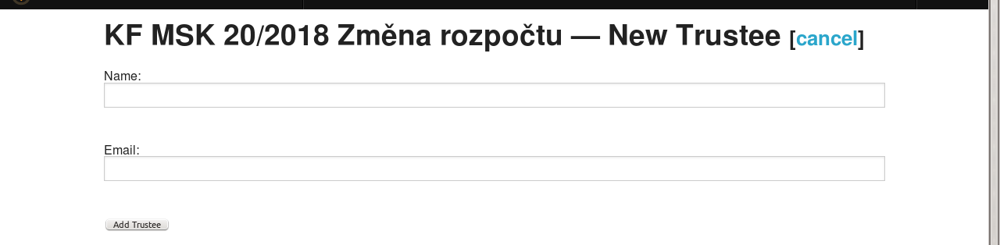

Do pole **Name** zadejte jménu, které se bude zobrazovat  v seznamu trustees. Můžete zadat občanské jméno dotyčného nebo jeho funkci (například *Vedoucí AO*).   
Do pole **Email** zadejte jeho pirátskou mailovou adresu.   
Přidání dokončete kliknutím na **Add Trustee*.

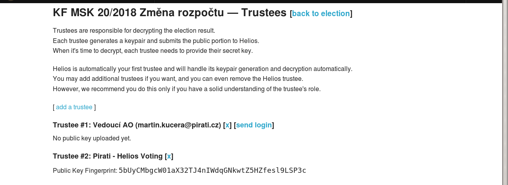

Proces ještě aspoň jednou nebo dvakrát zopakujte (pro hlasování oblastního sdružení postačí přidat 2 trustees, pro hlasování CF jsou vhodnější 3).   
Nyní je třeba každému z "lidských" trustees zaslat mail s odkazem na stránku, kde si připraví své šifrovací klíče. To provedete klikem na **send login**.   
(V případě, že trustee nestihne připravit klíče do zahájení hlasování, lze ho ze seznamu vymazat kliknutím na **x**.)   
Poté se vraťte na úvodní stránku hlasování. Nyní musíte vyčkat, než si trustees připraví své šifrovací klíče a nahrají veřejné klíče na server.

[Návod pro trustees](helios-trustees.md)

Když jste si jisti, že máte správně zadány všechny parametry hlasování, otázky i seznam voličů, a všichni trustees již nahráli své veřejné klíče na server, můžete pokračovat kliknutím na **Ukončit tvorbu hlasovacího lístku a zahájit hlasování**.

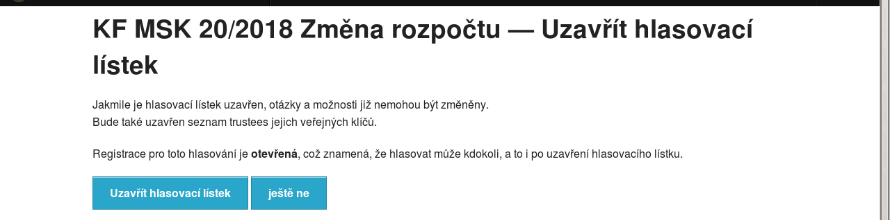

Rozhodnutí ukončit přípravu hlasování potvrdíte tlačítkem **Uzavřít hlasovací lístek**.    
**POZOR! Poté již nebude možné změnit ani popis hlasování, ani otázku a odpovědi, ani seznam voličů, ani seznam trustees!** 

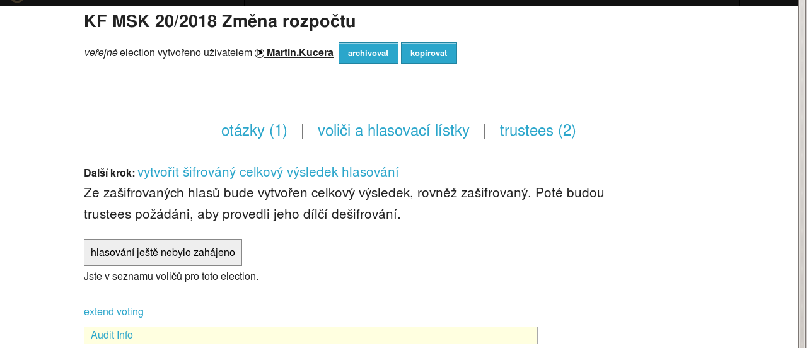

Hlasování bude automaticky zahájeno a ukončeno v časech, které jste nastavili. (Pokud jste čas nastavení nezadali, bude zahájeno okamžitě. Pokud jste nezadali čas ukončení, budete ho muset ukončit ručně kliknutím na **vytvořit šifrovaný celkový výsledek hlasování**.)   
Během hlasování můžete dobu trvání prodloužít kliknutím na **Extend voting**.

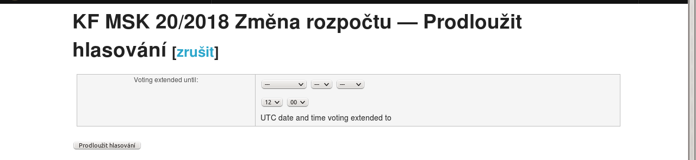

Zvolíte nový čas ukončení (v UTC) a potvrdíte klikem na **Prodloužit hlasování**.

Zahájení hlasování byste měli voličům oznámit e-mailem. To provedete z odkazu **voliči a hlasovací lístky** tlačítkem **Poslat voličům e-mail**. 

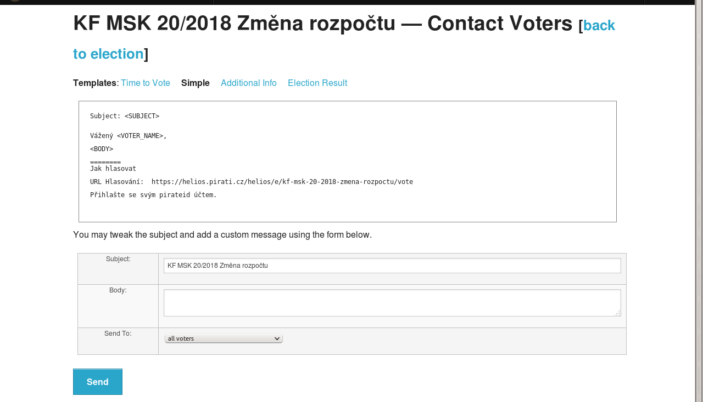

Z *Templates* vyberte *Simple* a do pole **Body** doplňte odkaz na úvodní stránku hlasování (protože Helios standardně posílá odkaz přímo na hlasovací budku). Ten získáte odstraněním "/vote" z URL hlasovací budky, který vidíte v náhledu mailu. Tedy například *https://helios.pirati.cz/helios/e/kf-msk-20-2018-zmena-rozpoctu*. Volbu **Send to** ponechte na *all voters* a odešlete e-mail tlačítkem **Send**.

Po naplánovaném ukončení hlasování klikněte na úvodní stránce na odkaz **vytvořit šifrovaný celkový výsledek hlasování**. Na následující stránce   

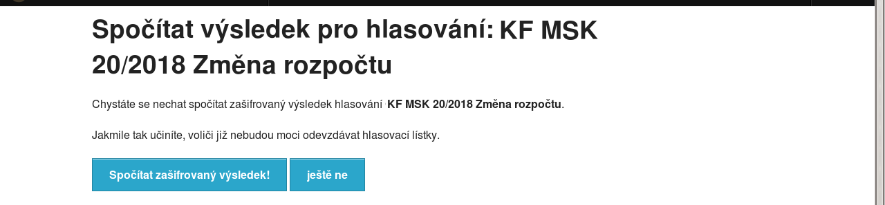

potvrďte tlačítkem **Spočítat zašifrovaný výsledek**.

Poté, co Helios výsledek zpracuje, budete muset vyzvat trustees, aby provedli svá dílčí dešifrování. To provedete opět z odkazu **trustees** kliknutím na **send login** pro každého ze seznamu.   
Poté zkombinujete dílčí dešifrování od jednotlivých trustees kliknutím na **spojit výsledky dešifrované trustees a vypočítat výsledek**. Na následující stránce

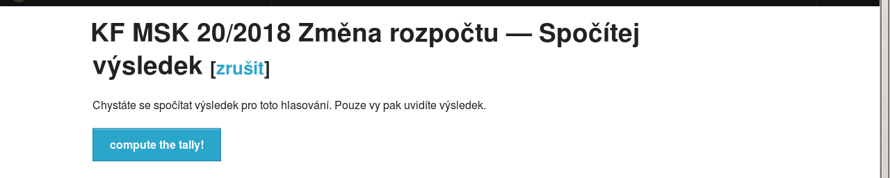

potvrďte tlačítkem **compute the tally**.

Helios následně jen pro vás zobrazí výsledek hlasování. 

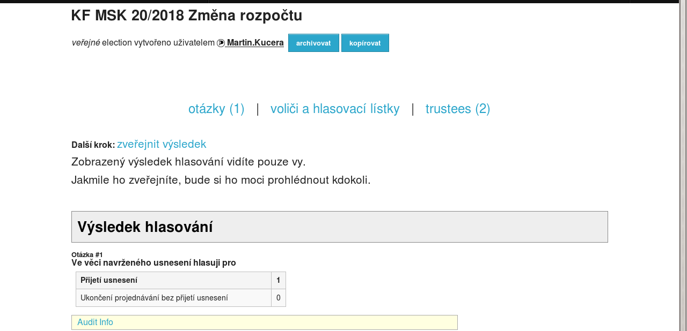

Ten zveřejníte kliknutím na **zveřejnit výsledek**. Poté jej uvidí každý, kdo si zbrazí úvodní stránku hlasování.

O zveřejnění výsledku byste měli voliče rovněž informovat e-mailem. (Opět z odkazu **voliči a hlasovací lístky** tlačítkem **Poslat voličům e-mail**. Jako *Template* vybrat *Election Result* a odeslat.)
