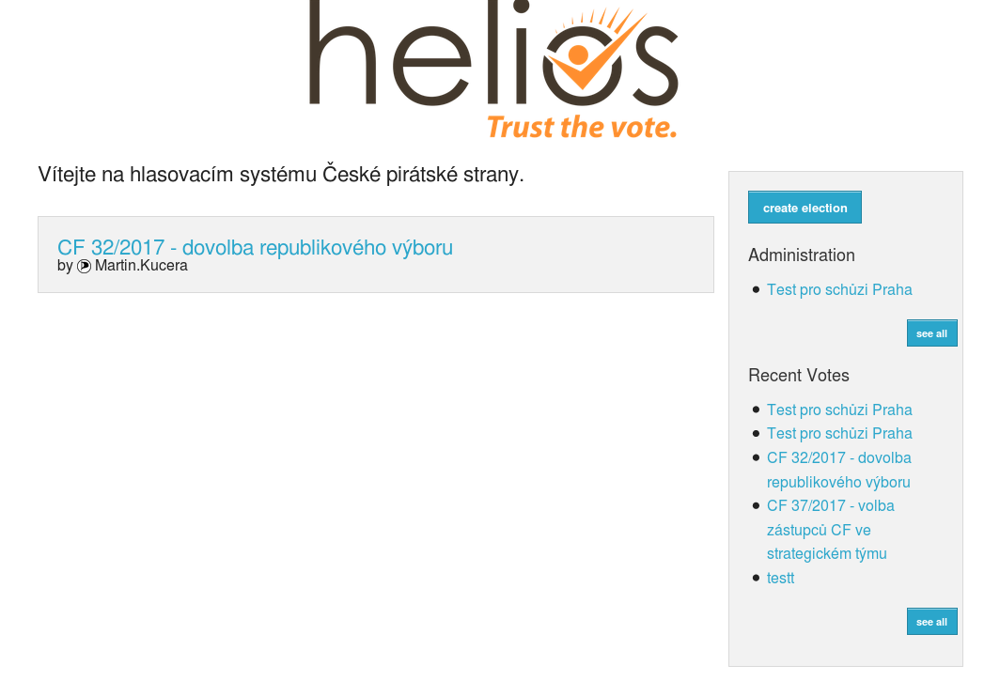
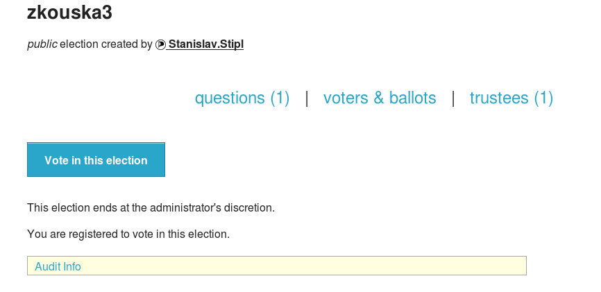
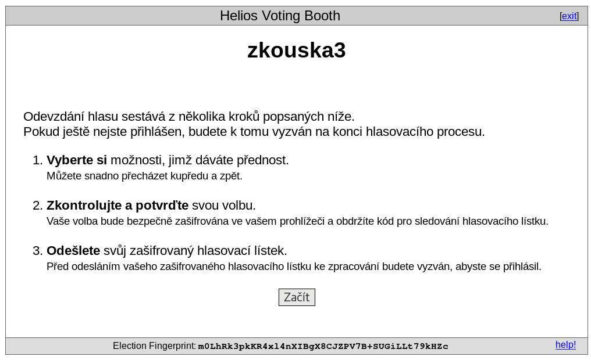
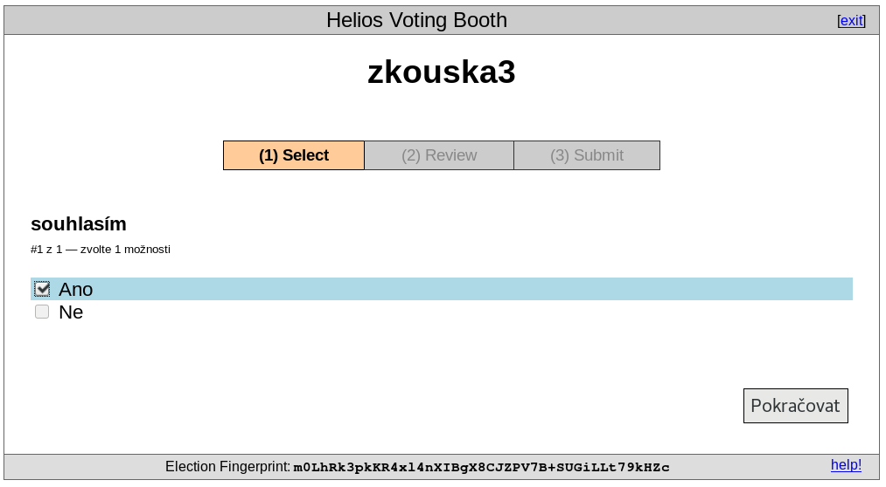
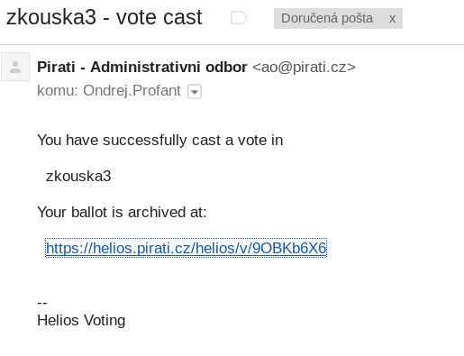

# Hlasování skrz Helios

Titulní stránka hlasovacího systému Helios na adrese **https://helios.pirati.cz**:

Přihlášení skrz pirátské openid:

Titulní stránka hlasovacího systému Helios po přihlášení:

Odkaz z mailu vede na takovouto

Stránka konkrétního hlasování ("zkouska3"), modrým tlačítkem "Vote in this election" zahájíte hlasování.

Popis průběhu odevzdání hlasu. Nejdříve je třeba připravit hlasovací lístek (obdoba plenty):

1\. krok hlasování. Vyberte danou možnost nebo možnosti:

2\. krok hlasování. Zkontrolujte zda jste zvolili správné možnosti. Dále postupujte tlačítkem "Odevzdat tento hlas!", ale pozor ještě následují další kroky.

Nyní máme připravený hlasovací lístek, systém viditelně zobrazí za koho jsme přihlášení. Nyní velkým modrým tlačíkem "ODEVZDAT tento lístek" anonymně odevzdáte lístek.

Po skončení hlasování vám přijde mail:

Po odevzdání hlasovacího lístku:

- budete odhlášeni
- po přihlášení můžete hlasovat znovu, počítá se poslední hlasování
