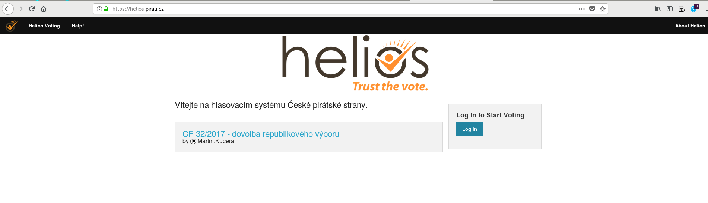
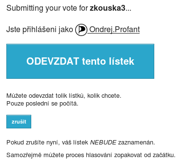

# Správa hlasování v Heliosu

Předpokládáme, že již víte, jak v Heliosu hlasovat a jak se do něj přihlásit, a že máte nastudován příslušný [návod](helios.md). 

Tvorbu hlasování zahájíte z titulní stránky tlačítkem Vytvořit hlasování

Objeví se formulář, v němž zadáte parametry hlasování. (Ty budete moci později podle potřeby upravit, ale jen do zahájení hlasování.)

Do pole **Short name** zadejte krátký název (jen písmena bez diakritiky, číslice, pomlčky a podtržítka) hlasování, který pak bude zvořit součást URL odkazu na něj. Například *kf-msk-20-2018-zmena-rozpoctu*.    
Do pole **Name** zadejte název hlasování, který se bude zobrazovat jako jeho nadpis. Například *KF MSK 20/2018 Změna rozpočtu*.    
Do pole **Description** zadejte všechny důležité informace o hlasování, tedy zejména 
* odkaz na rozpravu a závěrečné řeči
* přehled možností, mezi kterými budou hlasující vybírat
* způsob hlasování
* začátek a konec hlasování
Pro formátování textu použijte HTML syntaxi.   
Ve volbě **type** ponechte *Election*.   
Volbu **Use voter aliases** ponechte nezaškrtnutou. Úmožní to mj. snazší odhalení případného pokusu o podvodné hlsování.   
Volbu **Randomize answer order** ponechte nezaškrtnutou.    
Volbu **Private?** ponechte nezaškrtnutou.   
Do pole **Help Email Address** uveďte svou pirátskou mailovou adresu, aby vás hlasující mohli v případě problémů kontaktovat.   
Volbu **Voting starts at** nastavte na plánovaný čas zahájení hlasování. Časy se uvádějí v UTC, takže o 1 (resp. 2, pokud je letní čas) méně než náš místní čas. Pro zahájení v 10.00 letního času tedy nastavte 8.00.   
Volbu **Voting ends at** nastavte na plánovaný čas ukončení hlasování, opět v UTC.   

Po nastavení parametrů hlasování pokračujte tlačítkem **Pokračovat  >>** a dostanete se na úvodní stránku hlasování. Jeho parametry můžete upravovat po stisku tlačítka **upravit**.

Nyní je třeba zadat otázku a seznam voličů. K zadání otázky se dostanete z odkazu **otázky (0)**.

Ve volbě **Zvolte mezi 0 a 1 odpověďmi** nastavte místo *1* maximální počet hlasů, které má volič k dispozici. Typ výsledku ponechte *absolutní*.   
Do pole **Otázka** zadejte znění otázky, tedy například *Ve věci navrženého usnesení hlasuji pro*.   
Do polí **Odpověď #1** až **Odpověď #5** (nemusíte samozřejmě využít všechny) zadejte znění jednotlivých odpovědí, tedy například:   
**Odpověď #1:** *schválení usesení*   
**Odpověď #2:** *ukončení projednávání bez přijetí usnesení*   
V případě, že potřebujete více než 5 možností, klikněte na **přidat dalších 5 odpovědí**.   
Do polí **Odkaz** můžete vložit URL na stránku s podrobnějšími informacemi k dané možnosti, například při personálním hlasování odkaz na profil kandidáta.   
Zadávání otázky dokončíte tlačítkem **add question**.

Otázku a odpovědi můžete později upravit klikem na **edit**, případně smazat klikem na **x**. Na úvodní stránku hlasování se vrátíte klikem na **zpět k hlasování**.

Seznam voličů přidáte z odkazu **voliči a hlasovací lístky**.

Popis průběhu odevzdání hlasu. Nejdříve je třeba připravit hlasovací lístek (obdoba plenty):

1\. krok hlasování. Vyberte danou možnost nebo možnosti:

2\. krok hlasování. Zkontrolujte zda jste zvolili správné možnosti. Dále postupujte tlačítkem "Odevzdat tento hlas!", ale pozor ještě následují další kroky.

Nyní máme připravený hlasovací lístek, systém viditelně zobrazí za koho jsme přihlášení. Nyní velkým modrým tlačíkem "ODEVZDAT tento lístek" anonymně odevzdáte lístek.

Po skončení hlasování vám přijde mail:

Po odevzdání hlasovacího lístku:

- budete odhlášeni
- po přihlášení můžete hlasovat znovu, počítá se poslední hlasování
