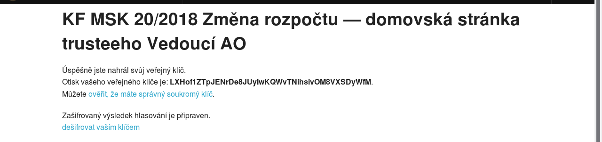
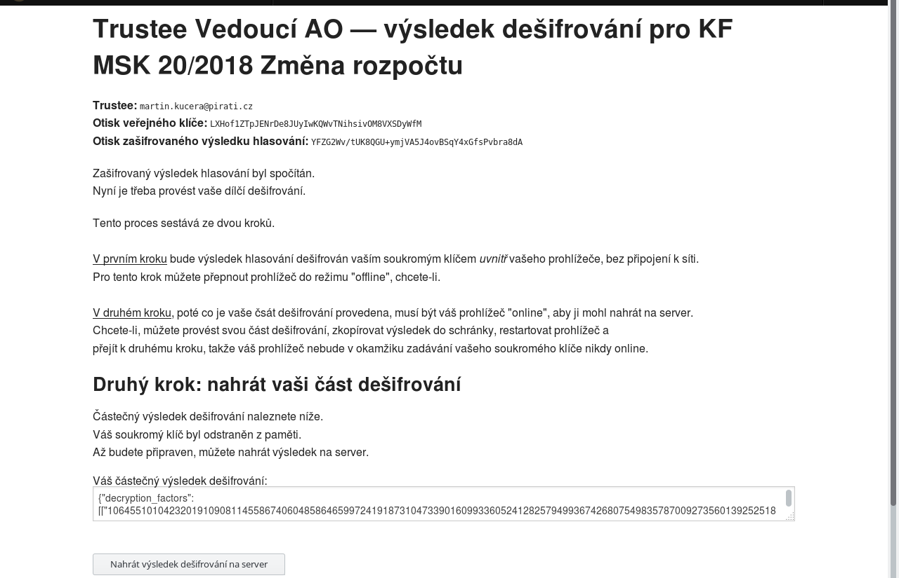
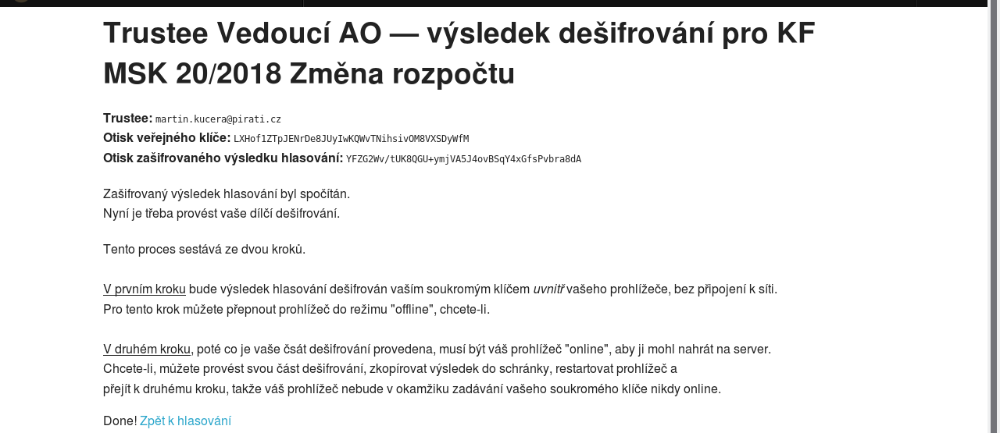

# Trustees a klíče

Pokud vás předsedající přidal jako trusteeho, obdržíte e-mail s odkazem na *domovskou stránku trusteeho*, kde nastavíte své klíče pro šifrování a dešifrování výsledků hlasování.

Na této stránce klikněte na **Nastavit váš klíč**.

Pokud ještě žádný pár klíčů vygenerovaný nemáte, nebo pokud si chcete vygenerovat nový, pokračujte stiskem tlačítka **Vygenerovat klíče pro hlasování**. Chcete-li opětovně použít klíče, které již máte vygenerovány z dřívějška, klikněte na **znovu použít** (a v návodu přejděte na ***Opětovné použití klíče***). 

## Vygenerování nového páru klíčů

Poté, co máte nový pár klíčů vygenerován, musíte si svůj tajný klíč uložit stiskem tlačítka **Uložit tajný klíč**.

Otevře se vám nové okno nebo tab a v něm váš tajný klíč. (Pozor, některé browsery, například Chrome či Chromium, nechtějí takovýmto způsobem tajný klíč zobrazit. Na odstranění problému pracujeme, v současné době ovšem nezbývá než použít například Firefox.)

Klikněte na **Raw data** pro zobrazení klíče v textové podobě.

Nyní si klíč uložte jako textový soubor (nazvaný třeba *klic20180625.txt*). Poté se vraťte na předchozí tab/okno.

Potvrďte, že jste si klíč uložil, klikem na **svůj klíč jsem uložil, pokračujme**.

Dále je třeba nahrát na server váš veřejný klíč, což učiníte stiskem tlačítka **Nahrát váš veřejný klíč na server**. (V návodu nyní přejděte na ***Po nahrání veřejného klíče***.)

## Opětovné použití klíče

Vložte celý svůj tajný klíč (tj. celý obsah textového souboru s klíčem) do okénka a stiskněte **opětovně použít**.

Nyní musíte nahrát na server váš veřejný klíč, což učiníte stiskem tlačítka **Nahrát váš veřejný klíč na server**. 

## Po nahrání veřejného klíče

Můžete si ještě ověřit, že váš soukromý (tajný) klíč je správný, klikem na příslušný odkaz.

Vložte celý svůj soukromý klíč (tj. celý obsah textového souboru s klíčem) do okénka a stiskněte **ověřit**.

## Po skončení hlasování

Poté, co jso výsledky hlasování sečteny a je vytvořen zašifrovaný celkový výsledek, zašle vám předsedající opět odkaz na vaši domovskou stránku trusteeho.

Můžete si znovu ověřit, že použijete správný soukromý klíč, a pokračovat kliknutím na **dešifrovat vaším klíčem**.

Vložte celý svůj soukromý klíč (tj. celý obsah textového souboru s klíčem) do okénka a stiskněte **Provést částečné dešifrování**.

Poté, co je částečné dešifrování provedeno, nahrajte jeho výsledek na server stiskem **Nahrát výsledek dešifrování na server**.
Tím je váš úkol coby trusteeho splněn.

