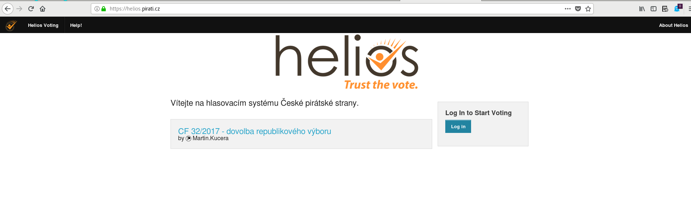
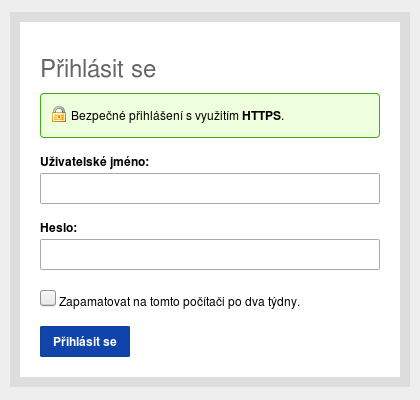
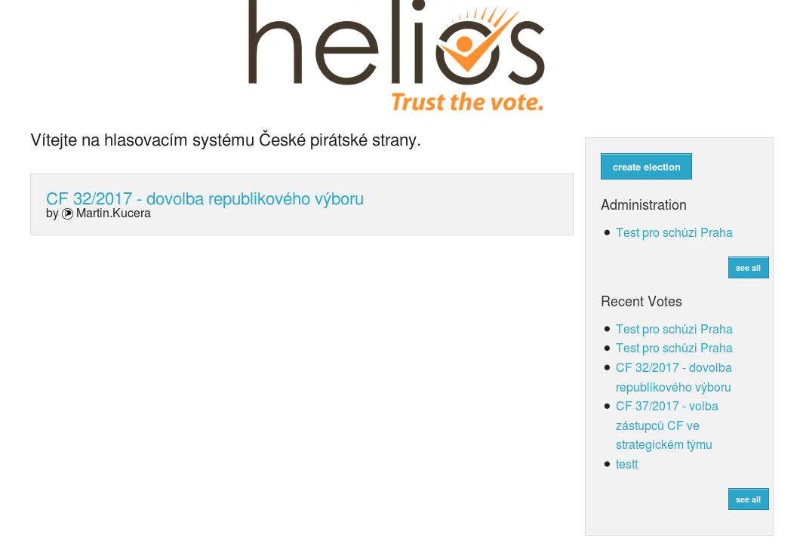
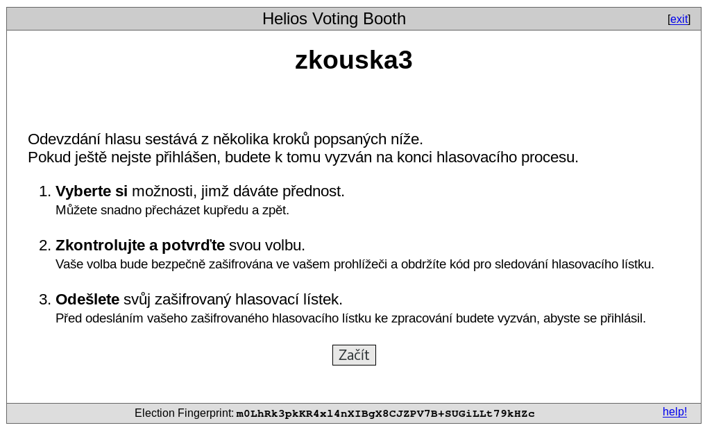
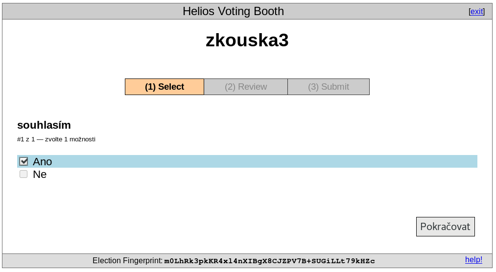
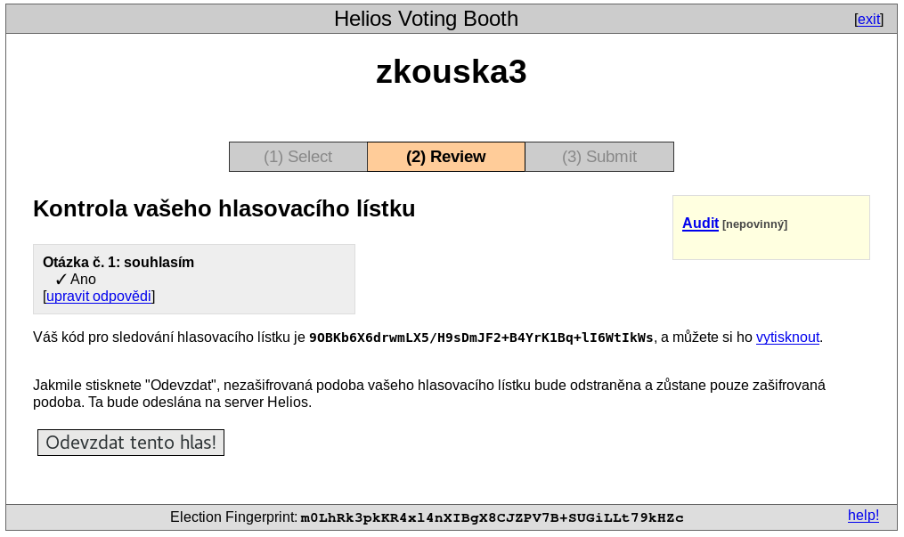
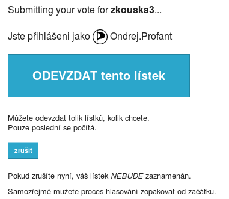
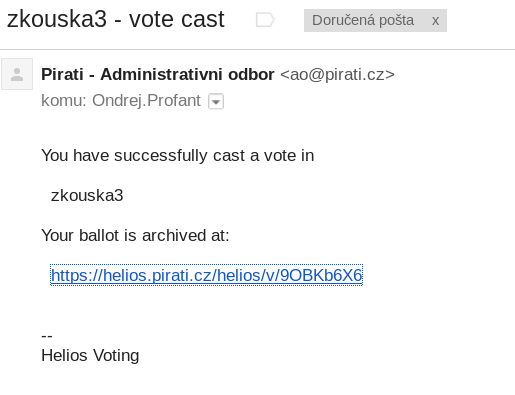

# Hlasování skrz Helios

Titulní stránka hlasovacího systému Helios na adrese **https://helios.pirati.cz**:

Přihlášení skrz pirátské openid:

Titulní stránka hlasovacího systému Helios po přihlášení:

Stránka konkrétního hlasování ("zkouska3"), modrým tlačítkem "Vote in this election" zahájíte hlasování.

Popis průběhu hlasování

1\. krok hlasování. Vyberte danou možnost nebo možnosti:

2\. krok hlasování. Zkontrolujte zda jste zvolili správné možnosti. Dále postupujte tlačítkem "Odevzdat tento hlas!", ale pozor ještě následují další kroky.

3\.

